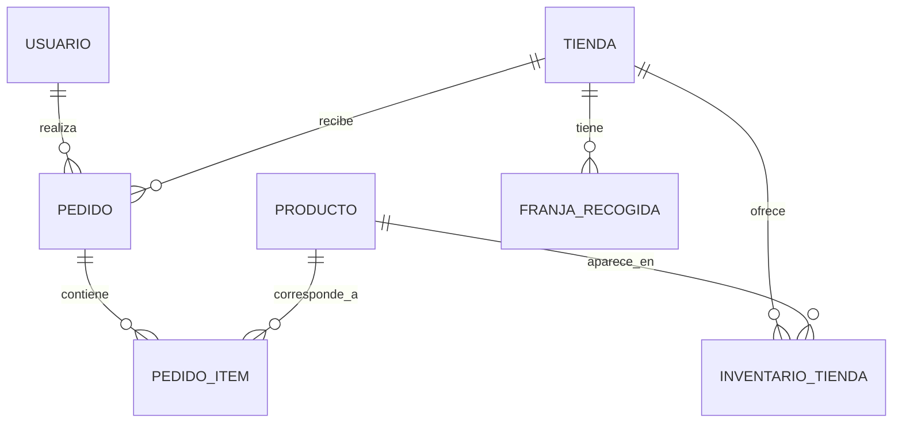
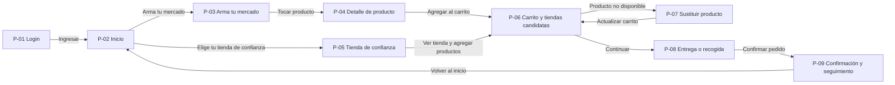

# Tu Tienda Cerca

| | |
|---|---|
| Integrantes | José Angel Lopez, Ana María Ávila Suarez |
| Curso y grupo | Programación Móvil (IF2004), grupo 601 |
| Versión | 1.0, 26 de septiembre de 2026 |

## Tabla de contenido

1. [Descripción general](#1-descripción-general)
2. [Problema](#2-problema)
3. [Objetivos](#3-objetivos)
4. [Stakeholders, actores y roles](#4-stakeholders-actores-y-roles)
5. [Alcance](#5-alcance)
6. [Funcionalidades](#6-funcionalidades)
7. [Requerimientos funcionales](#7-requerimientos-funcionales)
8. [Requerimientos no funcionales](#8-requerimientos-no-funcionales)
9. [Reglas de negocio](#9-reglas-de-negocio)
10. [Modelo de datos](#10-modelo-de-datos)
11. [Pantallas y mapa de navegación](#11-pantallas-y-mapa-de-navegación)
12. [Mockup](#12-mockup)
13. [Historias de usuario, casos de uso, restricciones y supuestos](#13-historias-de-usuario-casos-de-uso-restricciones-y-supuestos)
14. [Arquitectura técnica y navegación implementada](#14-arquitectura-técnica-y-navegación-implementada)
15. [Historial de cambios](#historial-de-cambios)
16. [Referencias](#referencias)
17. [Declaración de uso de inteligencia artificial](#declaración-de-uso-de-inteligencia-artificial)

## 1. Descripción general

**Tu Tienda Cerca** es una aplicación móvil pensada para personas que hacen compras cotidianas y quieren encontrar productos en tiendas de barrio cercanas sin tener que desplazarse por varias opciones. La app permite buscar productos, comparar qué tiendas pueden atender una lista de mercado y realizar un pedido simulado desde el celular.

La propuesta tiene dos rutas principales de compra. La primera es **“Arma tu mercado”**, donde el usuario agrega productos desde un catálogo general y luego la aplicación le muestra qué tiendas pueden cubrir toda su lista o la mayor parte. La segunda es **“Elige tu tienda de confianza”**, donde el usuario entra primero a una tienda específica y compra directamente desde su catálogo.

En esta primera versión, la aplicación se enfoca en el cliente como usuario principal. Incluye inicio de sesión, búsqueda, carrito, selección de tienda, validación de disponibilidad, modalidad de entrega o recogida y seguimiento del pedido con datos simulados.

## 2. Problema

En muchos barrios, las tiendas de barrio siguen siendo una opción importante para compras rápidas y cercanas. Aun así, frente a cadenas como D1, Ara, Ísimo u Oxxo, muchas de estas tiendas tienen una desventaja clara: no cuentan con un canal digital donde el cliente pueda consultar productos, comparar disponibilidad o hacer un pedido sin desplazarse.

Para el cliente, esto se traduce en una experiencia poco eficiente. Si necesita productos básicos como arroz, leche, huevos o artículos de aseo, normalmente debe caminar a varias tiendas, llamar, escribir mensajes o comprar donde encuentre primero, sin saber si otra tienda cercana podría ofrecerle todos los productos que necesita en una sola compra.

El problema no es solo la falta de digitalización de las tiendas, sino también la falta de una forma centralizada de buscar productos entre varias opciones cercanas y decidir con información más clara. Actualmente, el cliente no sabe con anticipación qué tienda puede atender mejor su lista de mercado, cuánto le costaría el domicilio o si tendrá que reemplazar productos faltantes.

La solución se plantea como una aplicación móvil porque este tipo de necesidad aparece en contextos cotidianos y rápidos, donde la persona toma la decisión desde el celular. Además, una app permite construir un flujo claro de búsqueda, carrito, comparación de tiendas y confirmación del pedido, que es justamente el núcleo del problema que se quiere resolver.

## 3. Objetivos

### 3.1 Objetivo general

Permitir que un cliente encuentre, entre tres y cinco tiendas de barrio simuladas, la tienda que cubra todos o la mayor cantidad posible de productos de su lista y complete un pedido simulado en menos de 3 minutos.

### 3.2 Objetivos específicos

- Permitir que el cliente busque productos por nombre, marca o categoría desde un catálogo general y desde el catálogo de una tienda.
- Mostrar las tiendas candidatas ordenadas según la cantidad de productos disponibles, la distancia y el costo estimado de domicilio.
- Validar nuevamente la disponibilidad de los productos antes de confirmar el pedido.
- Ofrecer al cliente tres modalidades de atención: domicilio, recogida inmediata y recogida programada.
- Permitir la consulta del estado e historial básico de pedidos para dar seguimiento a las compras realizadas.

## 4. Stakeholders, actores y roles

### 4.1 Stakeholders

- **Cliente:** necesita encontrar y pedir productos de tiendas cercanas de forma práctica.
- **Tendero:** busca más visibilidad y más oportunidades de venta frente a grandes cadenas.
- **Domiciliario:** podría participar en una fase futura del proyecto.
- **Comunidad del barrio:** se beneficia de una propuesta que fortalece el comercio local.

### 4.2 Actores

- **Cliente:** consulta tiendas y productos, arma su carrito, elige una modalidad de entrega y confirma pedidos.
- **Servicio de notificaciones:** informa al usuario cambios en el estado del pedido.

### 4.3 Roles

| Rol | Descripción | Qué puede hacer |
|---|---|---|
| Cliente | Usuario principal de la aplicación en el MVP. | Iniciar sesión, buscar productos, explorar tiendas, agregar productos al carrito, elegir una tienda, confirmar un pedido y consultar pedidos. |
| Tendero simulado | Representado mediante datos precargados. | No interactúa directamente con la aplicación en esta versión. |
| Domiciliario simulado | Representado mediante estados simulados del pedido. | No interactúa directamente con la aplicación en esta versión. |

En esta primera entrega, el único rol interactivo real es el cliente. Los tenderos y domiciliarios existen dentro del dominio del problema, pero sus acciones se representan con información simulada y no con pantallas propias.

### 4.4 Login

La aplicación contará con una pantalla de inicio de sesión con correo electrónico y contraseña. Para el alcance de este entregable, el acceso puede ser simulado con datos fijos, siempre que permita entrar a la app y recorrer el flujo completo de navegación.

## 5. Alcance

La primera versión de **Tu Tienda Cerca** se construirá únicamente para el cliente. La idea es resolver el problema central de búsqueda, comparación y pedido básico, sin intentar abarcar todavía toda la operación real de una tienda o de un servicio de domicilios.

### 5.1 Incluye

- Consulta de tres a cinco tiendas simuladas con sus productos.
- Ruta **“Elige tu tienda de confianza”** para entrar a una tienda específica y comprar desde su catálogo.
- Ruta **“Arma tu mercado”** para agregar productos desde un catálogo general sin escoger tienda al inicio.
- Carrito con comparación de tiendas candidatas.
- Selección de una tienda antes de confirmar el pedido.
- Validación de disponibilidad antes de finalizar la compra.
- Modalidades de domicilio, recogida inmediata o recogida programada.
- Seguimiento e historial básico de pedidos simulados.

### 5.2 No incluye

- Aplicación o panel para tenderos.
- Aplicación o panel para domiciliarios.
- Pagos reales o integración con pasarelas de pago.
- Facturación.
- Geolocalización en tiempo real o seguimiento GPS.
- División de un mismo pedido entre varias tiendas.
- Chat con la tienda o integración con WhatsApp.
- Programas de fidelización, cupones o promociones complejas.

## 6. Funcionalidades

### 6.1 Funcionalidades del cliente

- Iniciar sesión.
- Ver la pantalla principal con buscador y accesos directos.
- Buscar productos por nombre, marca o categoría.
- Consultar tiendas cercanas simuladas.
- Ver el detalle de un producto.
- Agregar productos al carrito desde el catálogo general.
- Agregar productos al carrito desde una tienda específica.
- Ver qué tiendas pueden atender toda la lista o parte de ella.
- Sustituir o eliminar productos no disponibles.
- Elegir modalidad de entrega o recogida.
- Confirmar un pedido simulado.
- Consultar el estado y el historial de pedidos.

### 6.2 Funcionalidades del sistema

- Calcular tiendas candidatas según la disponibilidad de los productos agregados.
- Revalidar la disponibilidad antes de confirmar.
- Mostrar estados simulados del pedido para seguimiento.

## 7. Requerimientos funcionales

| ID | Requerimiento | Rol | Prioridad |
|---|---|---|---|
| RF-01 | La app debe permitir al cliente iniciar sesión mediante una pantalla con correo y contraseña. | Cliente | Alta |
| RF-02 | La app debe mostrar una pantalla de inicio con buscador, categorías y accesos a “Arma tu mercado” y “Elige tu tienda de confianza”. | Cliente | Alta |
| RF-03 | La app debe permitir consultar una lista de tiendas cercanas simuladas. | Cliente | Alta |
| RF-04 | La app debe permitir buscar productos por nombre, marca o categoría. | Cliente | Alta |
| RF-05 | La app debe mostrar el detalle del producto seleccionado, incluyendo nombre, presentación, precio y opción para agregarlo al carrito. | Cliente | Alta |
| RF-06 | La app debe permitir agregar productos al carrito desde el catálogo general sin elegir una tienda desde el inicio. | Cliente | Alta |
| RF-07 | La app debe permitir agregar productos al carrito desde el catálogo de una tienda específica. | Cliente | Alta |
| RF-08 | La app debe mostrar las tiendas candidatas que pueden cubrir todos o parte de los productos agregados al carrito. | Cliente | Alta |
| RF-09 | La app debe permitir elegir una única tienda antes de confirmar el pedido. | Cliente | Alta |
| RF-10 | La app debe permitir sustituir, eliminar o ajustar productos cuando alguno no esté disponible. | Cliente | Media |
| RF-11 | La app debe permitir seleccionar domicilio, recogida inmediata o recogida programada como modalidad de entrega. | Cliente | Alta |
| RF-12 | La app debe permitir confirmar un pedido simulado después de validar la disponibilidad final de los productos. | Cliente | Alta |
| RF-13 | La app debe mostrar una pantalla de confirmación con el código del pedido y su estado inicial. | Cliente | Media |
| RF-14 | La app debe permitir consultar el historial y estado de los pedidos realizados. | Cliente | Media |

## 8. Requerimientos no funcionales

| ID | Categoría | Requerimiento |
|---|---|---|
| RNF-01 | Persistencia | La app debe conservar localmente la sesión, el carrito y el historial básico de pedidos entre aperturas. |
| RNF-02 | Rendimiento | La app debe abrir y mostrar la pantalla principal en menos de 3 segundos en un dispositivo Android de gama media. |
| RNF-03 | Usabilidad | Todo elemento táctil debe tener un tamaño mínimo de 48 por 48 píxeles lógicos. |
| RNF-04 | Compatibilidad | La app debe ejecutarse correctamente en Android mediante `flutter run`, sin errores en emulador o dispositivo físico. |
| RNF-05 | Navegación | La navegación entre pantallas debe implementarse con `Navigator.push` y `Navigator.pop`, de acuerdo con lo visto en clase. |
| RNF-06 | Claridad visual | Cada pantalla debe permitir identificar claramente su propósito mediante títulos, botones y contenido reconocible. |
| RNF-07 | Consistencia | La interfaz debe mantener una línea visual coherente en colores, tipografía, botones y navegación. |
| RNF-08 | Datos | El MVP debe funcionar con datos simulados precargados, sin depender de conexión con tiendas reales o servicios externos en tiempo real. |
| RNF-09 | Seguridad | En esta versión, el login puede ser simulado, pero en una versión posterior la contraseña no deberá almacenarse en texto plano. |

## 9. Reglas de negocio

- **RN-01.** Un pedido solo puede confirmarse si el carrito contiene al menos un producto.
- **RN-02.** La búsqueda debe mostrar productos relacionados con el término ingresado por nombre, marca o categoría.
- **RN-03.** Al agregar productos desde el catálogo general, la aplicación debe calcular las tiendas candidatas según disponibilidad.
- **RN-04.** Las tiendas que tienen todos los productos del carrito deben aparecer antes que las que solo cubren una parte.
- **RN-05.** Si ninguna tienda tiene todo el mercado, la app debe mostrar las opciones con mayor coincidencia e indicar los productos faltantes.
- **RN-06.** Cada pedido solo puede confirmarse con productos de una única tienda.
- **RN-07.** Antes de confirmar el pedido, la app debe validar nuevamente la disponibilidad de los productos.
- **RN-08.** Si un producto no está disponible, el usuario debe poder eliminarlo, cambiar la cantidad o sustituirlo por una alternativa similar.
- **RN-09.** Después de sustituir o eliminar un producto, la app debe recalcular las tiendas candidatas.
- **RN-10.** La recogida programada solo puede elegirse en franjas futuras dentro del horario de atención de la tienda.

## 10. Modelo de datos

| Entidad | Atributos principales | Dónde se guarda |
|---|---|---|
| Usuario | id, nombre, correo, contraseña, rol | Local para sesión simulada |
| Tienda | id, nombre, dirección, distancia, horario, costo_domicilio, estado | Datos precargados |
| Producto | id, nombre, marca, categoría, presentación, precio_base, descripción | Datos precargados |
| InventarioTienda | id, tienda_id, producto_id, precio, disponible, stock_simulado | Datos precargados |
| CarritoItem | id, producto_id, nombre, cantidad, precio_referencia, tienda_sugerida | Local |
| Pedido | id, codigo, tienda_id, total_estimado, modalidad_entrega, estado, fecha | Local |
| PedidoItem | id, pedido_id, producto_id, nombre, cantidad, precio | Local |
| FranjaRecogida | id, tienda_id, fecha, hora_inicio, hora_fin, disponible | Datos precargados |

### Relaciones

- Un usuario puede tener varios pedidos.
- Una tienda puede ofrecer varios productos.
- Un pedido pertenece a una sola tienda.
- Un pedido contiene varios productos.
- Una tienda puede tener varias franjas de recogida.



## 11. Pantallas y mapa de navegación

### 11.1 Tabla de pantallas

| ID | Pantalla | Rol | Para qué sirve | Atiende |
|---|---|---|---|---|
| P-01 | Inicio de sesión | Cliente | Permitir el acceso a la app. | RF-01 |
| P-02 | Inicio | Cliente | Mostrar accesos principales, categorías, búsqueda y navegación general. | RF-02 |
| P-03 | Arma tu mercado | Cliente | Buscar productos desde el catálogo general y agregarlos al carrito. | RF-04, RF-06 |
| P-04 | Detalle de producto | Cliente | Ver la información de un producto y agregarlo al carrito. | RF-05 |
| P-05 | Tienda de confianza | Cliente | Consultar tiendas cercanas y entrar al catálogo de una tienda. | RF-03, RF-07 |
| P-06 | Carrito y tiendas candidatas | Cliente | Revisar productos agregados y comparar tiendas candidatas. | RF-08, RF-09 |
| P-07 | Sustituir producto | Cliente | Resolver la falta de disponibilidad de un producto. | RF-10 |
| P-08 | Entrega o recogida | Cliente | Elegir modalidad de entrega o recogida. | RF-11 |
| P-09 | Confirmación y seguimiento | Cliente | Confirmar el pedido y ver su estado. | RF-12, RF-13, RF-14 |

### 11.2 Flujo lista a detalle

La aplicación cumple el requisito de lista a detalle cuando el usuario entra a **P-03 Arma tu mercado**, ve una lista de productos y toca uno para pasar a **P-04 Detalle de producto**. En ese paso viaja la información del producto seleccionado, por lo que no se muestra siempre el mismo detalle.

### 11.3 Formulario

La app incluye al menos un formulario en **P-01 Inicio de sesión**, donde el usuario escribe correo y contraseña. También puede reforzarse el uso de formularios en la pantalla de entrega o recogida, si se agregan campos o selecciones adicionales.

### 11.4 Mapa de navegación



## 12. Mockup

Los mockups proponen una interfaz sencilla, cercana y pensada para compras cotidianas. La línea visual usa verde como color principal, crema como apoyo, un acento terracota, fondo claro, tipografía Inter e íconos simples para mantener una apariencia amable y fácil de entender.

### P-01 Inicio de sesión


Pantalla de acceso con correo, contraseña y una presentación breve de la propuesta de valor de la aplicación.

### P-02 Inicio


Pantalla principal con saludo, buscador, accesos a las dos rutas de compra, categorías destacadas, tiendas cercanas y barra de navegación inferior.

### P-03 Arma tu mercado


Pantalla de búsqueda y catálogo general donde el usuario puede agregar productos sin escoger una tienda desde el principio.

### P-04 Detalle de producto


Pantalla donde se muestra el nombre del producto, su presentación, precio, descripción, alternativas y la opción de agregarlo al carrito.

### P-05 Tienda de confianza


Pantalla con la lista de tiendas cercanas para que el usuario escoja una tienda específica y compre desde su catálogo.

### P-06 Carrito y tiendas candidatas


Pantalla donde se muestran los productos agregados y las tiendas que pueden cubrir total o parcialmente la compra.

### P-07 Sustituir producto


Pantalla que ayuda al usuario a resolver la falta de disponibilidad mediante productos alternativos o eliminación del artículo.

### P-08 Entrega o recogida


Pantalla para escoger entre domicilio, recogida inmediata o recogida programada, con el total estimado visible.

### P-09 Confirmación y seguimiento


Pantalla final donde se confirma el pedido y se muestra su estado inicial.

## 13. Historias de usuario, casos de uso, restricciones y supuestos

### 13.1 Historias de usuario

- **HU-01.** Como cliente, quiero consultar las tiendas cercanas y sus catálogos, para elegir mi tienda de confianza.
- **HU-02.** Como cliente, quiero buscar productos por nombre, marca o categoría, para encontrar el artículo que necesito y opciones similares.
- **HU-03.** Como cliente, quiero agregar productos desde un catálogo general, para armar mi mercado sin escoger una tienda desde el inicio.
- **HU-04.** Como cliente, quiero ver qué tiendas tienen todos o la mayor cantidad de productos de mi carrito, para elegir la opción más conveniente.
- **HU-05.** Como cliente, quiero consultar la distancia y el costo estimado de domicilio de cada tienda candidata, para decidir dónde realizar el pedido.
- **HU-06.** Como cliente, quiero sustituir un producto no disponible por una alternativa similar, para completar la compra sin empezar de nuevo.
- **HU-07.** Como cliente, quiero validar la disponibilidad antes de confirmar, para evitar errores en el pedido.
- **HU-08.** Como cliente, quiero elegir domicilio, recogida inmediata o recogida programada, para recibir el pedido de acuerdo con mi tiempo.
- **HU-09.** Como cliente, quiero consultar el estado y el historial de mis pedidos, para hacer seguimiento a mis compras.

### 13.2 Casos de uso

#### CU-01. Armar mi mercado por productos

**Actor:** Cliente.

**Precondición:** El cliente tiene acceso al catálogo general y existen tiendas simuladas con productos cargados.

**Flujo principal:**
1. El cliente busca o selecciona productos por nombre, marca o categoría.
2. La aplicación muestra coincidencias y opciones relacionadas.
3. El cliente agrega uno o varios productos al carrito.
4. La aplicación calcula las tiendas candidatas.
5. El cliente entra al carrito.
6. La aplicación muestra las tiendas que pueden atender todo o parte del mercado.
7. El cliente revisa las opciones.
8. El cliente selecciona una tienda para continuar.

**Excepción:** Si ninguna tienda tiene todos los productos, la app informa cuáles faltan y permite eliminarlos o sustituirlos.

#### CU-02. Comprar en una tienda de confianza

**Actor:** Cliente.

**Precondición:** El cliente tiene acceso a la lista de tiendas cercanas.

**Flujo principal:**
1. El cliente entra a **“Elige tu tienda de confianza”**.
2. La aplicación muestra las tiendas disponibles.
3. El cliente selecciona una tienda.
4. La app muestra su catálogo.
5. El cliente agrega productos al carrito.
6. El cliente continúa con el pedido.

**Excepción:** Si la tienda no tiene productos disponibles, la aplicación lo informa y permite volver a la lista de tiendas.

#### CU-03. Confirmar pedido

**Actor:** Cliente.

**Precondición:** El cliente tiene productos en el carrito y ya eligió una tienda.

**Flujo principal:**
1. El cliente revisa el carrito.
2. La app valida nuevamente la disponibilidad.
3. El cliente elige domicilio, recogida inmediata o recogida programada.
4. Si selecciona recogida programada, elige una franja disponible.
5. El cliente confirma el pedido.
6. La aplicación muestra el pedido creado y su estado inicial.

**Excepción:** Si algún producto deja de estar disponible, la app permite eliminarlo, ajustar la cantidad o elegir un sustituto antes de confirmar.

### 13.3 Restricciones

- Los datos de tiendas, productos, disponibilidad y estado de pedidos serán simulados.
- No habrá pagos reales.
- No habrá logística en tiempo real ni GPS.
- Cada pedido se hará en una sola tienda.
- La implementación se hará con lo visto en clase.

### 13.4 Supuestos

- El usuario cuenta con un celular Android funcional.
- Existen entre tres y cinco tiendas simuladas con catálogos cargados.
- El login del MVP puede funcionar con validación local o usuarios fijos.
- Las distancias, costos y estados del pedido se mostrarán como datos simulados.

## 14. Arquitectura técnica y navegación implementada

### 14.1 Entorno técnico

El proyecto se desarrollará en Flutter y Dart, usando una estructura simple y entendible por el equipo. La navegación entre pantallas se implementará con `Navigator.push` y `Navigator.pop`, evitando paquetes o patrones que no se hayan trabajado en clase.

### 14.2 Paquetes previstos

| Paquete | Uso previsto |
|---|---|
| flutter | Base del proyecto y widgets principales |
| cupertino_icons | Íconos básicos del proyecto |
| shared_preferences o equivalente visto en clase | Persistencia simple de sesión, carrito o pedidos, si se implementa en esta etapa |

### 14.3 Estructura de carpetas

```text
README.md
docs/
  definicion.md
  mockup/
  presentacion/
lib/
  main.dart
  pantallas/
  widgets/
pubspec.yaml
```

La organización del proyecto busca separar cada pantalla en su propio archivo y dejar `main.dart` como punto de entrada. Esto facilita que cada integrante entienda el recorrido de la app y pueda explicar la navegación durante la sustentación.

### 14.4 Tabla de rutas y pantallas

| Pantalla | Archivo | Se llega desde | Recibe |
|---|---|---|---|
| P-01 Inicio de sesión | `lib/pantallas/login.dart` | `main.dart` | Nada |
| P-02 Inicio | `lib/pantallas/inicio.dart` | P-01 | Usuario o nada |
| P-03 Arma tu mercado | `lib/pantallas/mercado.dart` | P-02 | Nada |
| P-04 Detalle de producto | `lib/pantallas/producto.dart` | P-03 | Producto seleccionado |
| P-05 Tienda de confianza | `lib/pantallas/tiendas.dart` | P-02 | Nada |
| P-06 Carrito y tiendas candidatas | `lib/pantallas/carrito.dart` | P-03, P-04 o P-05 | Lista de productos o carrito actual |
| P-07 Sustituir producto | `lib/pantallas/sustituir_producto.dart` | P-06 | Producto no disponible o alternativas |
| P-08 Entrega o recogida | `lib/pantallas/entrega_recogida.dart` | P-06 | Tienda seleccionada y carrito |
| P-09 Confirmación y seguimiento | `lib/pantallas/pedido_confirmado.dart` | P-08 | Resumen del pedido |

### 14.5 Navegación implementada

La aplicación debe permitir recorrer todas las pantallas definidas en el mockup y en el mapa de navegación sin dejar pantallas aisladas. El usuario debe poder avanzar y regresar dentro del flujo principal de compra, desde el login hasta la confirmación del pedido.

Además, la app debe cumplir con el paso de datos entre pantallas. En particular, cuando el usuario toca un producto en la lista de **Arma tu mercado**, la aplicación debe navegar a la pantalla **P-04 Detalle de producto** y mostrar la información del producto seleccionado, no un contenido fijo.

## Historial de cambios

| Fecha | Cambio realizado | Responsable |
|---|---|---|
| 2026-09-26 | Creación de la primera versión del documento de definición. | José Angel Lopez, Ana María Ávila Suarez |
| 2026-09-26 | Reorganización del borrador inicial y alineación con las pantallas del mockup. | José Angel Lopez, Ana María Ávila Suarez |
| 2026-09-26 | Ajuste de redacción, revisión de requerimientos y actualización de rutas de pantallas. | José Angel Lopez, Ana María Ávila Suarez |

## Referencias

- Documentación oficial de Flutter sobre navegación y rutas.
- Guía del curso para el primer entregable de definición del proyecto y navegación.
- Borrador interno del proyecto **Tu Tienda Cerca**.
- Mockups del proyecto elaborados como referencia visual del flujo.

## Declaración de uso de inteligencia artificial

Se utilizó una herramienta de inteligencia artificial como apoyo para reorganizar el borrador inicial del proyecto en la estructura solicitada para `docs/definicion.md`, mejorar la redacción, ordenar tablas y dejar el documento con un formato más claro.

Las ideas principales del proyecto, el problema, el alcance, las reglas de negocio, las historias de usuario, los casos de uso y la propuesta general de navegación fueron definidos por el equipo. La versión final fue revisada y ajustada manualmente antes de su entrega.